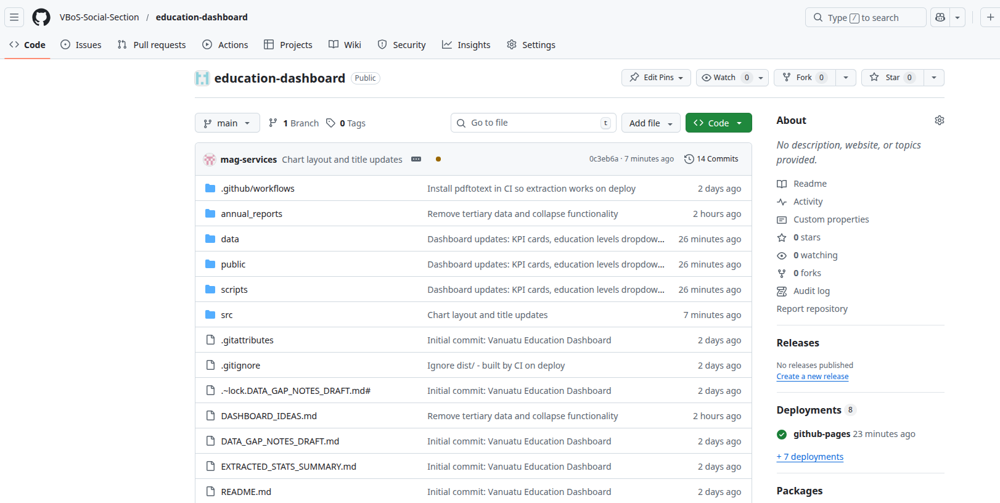
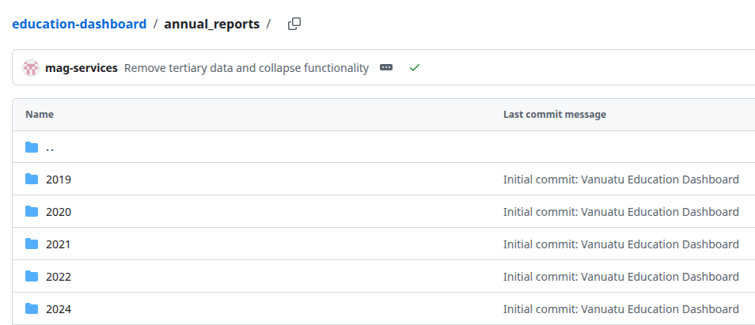
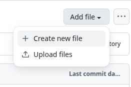
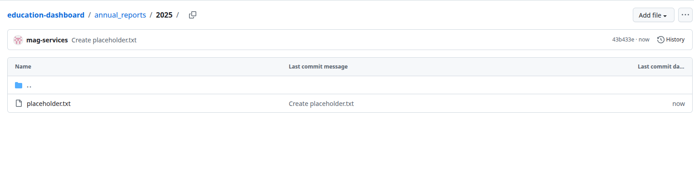
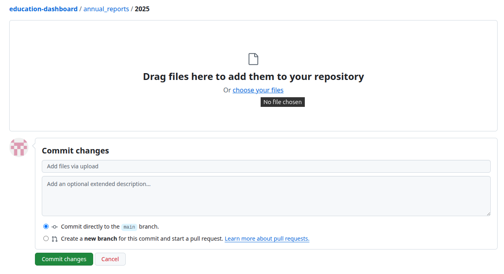
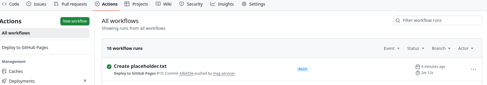

## Overview

This guide explains how to add a new year's MoET Annual Report to the Vanuatu Education Dashboard. You do **not** need to know programming or use Git. You will upload the PDF file directly through the GitHub website.

**Dashboard repository:** [https://github.com/VBoS-Social-Section/education-dashboard](https://github.com/VBoS-Social-Section/education-dashboard)

::: {.callout-note}
## What happens when you upload

When you upload a new report and save your changes, GitHub automatically runs a process that:

1. Extracts data from the PDF
2. Rebuilds the dashboard
3. Updates the live website (if hosted on GitHub Pages)

You only need to upload the file. The rest is automatic.
:::

---

## Step 1: Open the repository

1. Open your web browser (Chrome, Firefox, Edge, etc.).
2. Go to: **https://github.com/VBoS-Social-Section/education-dashboard**
3. You should see the project files (folders like `annual_reports`, `src`, `public`, etc.).

{width=80%}

---

## Step 2: Go to the annual reports folder

1. In the list of files and folders, find **`annual_reports`**.
2. Click on **`annual_reports`** to open it.

{width=80%}

---

## Step 3: Create a folder for the new year

1. Click the **"Add file"** button (top right).
2. Select **"Create new file"** from the dropdown.

{width=80%}

3. In the file name box at the top, type: **`2025/placeholder.txt`**  
   (Replace `2025` with the year of your report, e.g. `2026` for the 2026 report. The `/` creates the folder.)
4. In the editor area, type anything (e.g. `x`) so the file is not empty.
5. Scroll down and click **"Commit new file"** (green button).
6. This creates a new folder for that year.

::: {.callout-tip}
## Alternative: Upload into an existing folder

If a folder for your year already exists (e.g. `2025`), skip this step and go to Step 4. You can upload directly into that folder.
:::

{width=80%}

---

## Step 4: Upload the MoET report PDF

1. Open the folder you created (e.g. **`2025`**).
2. Delete the placeholder file if you created one: click **`placeholder.txt`**, then click the trash icon, and commit the change.
3. Click **"Add file"** → **"Upload files"**.
4. Drag your MoET Annual Report PDF into the upload area, or click **"choose your files"** to browse.
5. The filename should include the year (e.g. `MoET-Statistical-Report-2025.pdf` or `2025 MoET Report.pdf`). This helps the system recognise the year.
6. Add a short note in the commit message box, e.g. **"Add 2025 annual report"**.
7. Click **"Commit changes"** (green button).

{width=80%}

---

## Step 5: Wait for the automatic build

1. After you commit, GitHub will automatically start building the dashboard.
2. To check the status, click the **"Actions"** tab at the top of the repository.
3. You should see a workflow run. A yellow circle means it is running; a green tick means it finished successfully.
4. The build usually takes 2–5 minutes.

{width=80%}

---

## Step 6: View the updated dashboard

Once the build completes successfully:

1. If the dashboard is hosted on GitHub Pages, it will update automatically.
2. Open the dashboard URL (e.g. `https://vbos-social-section.github.io/education-dashboard/` — check with your team for the exact URL).
3. Use the year filter to select the new year and confirm the new data appears.

{width=80%}

---

## Troubleshooting

### The build failed (red X in Actions)

- Check that the PDF is a valid MoET Annual Statistical Report.
- Ensure the report format matches previous years (Tables 1, 3, 4 for Enrolment, Schools, Teachers).
- If the report layout has changed, a developer may need to update the extraction script.

### I don't have permission to upload

- You need write access to the repository. Ask your administrator to add you as a collaborator or to upload the file for you.

### The new year doesn't appear in the dashboard

- Wait a few minutes for the build to finish.
- Refresh the dashboard page (Ctrl+F5 or Cmd+Shift+R).
- Clear your browser cache if needed.

---

## Summary

| Step | Action |
|------|--------|
| 1 | Open https://github.com/VBoS-Social-Section/education-dashboard |
| 2 | Go to the `annual_reports` folder |
| 3 | Create a folder for the year (e.g. `2025`) if it doesn't exist |
| 4 | Upload the MoET PDF into that folder and commit |
| 5 | Wait for the automatic build (2–5 minutes) |
| 6 | View the updated dashboard |

---

## Need help?

Contact your dashboard administrator or the VBoS Social Section team for support.
